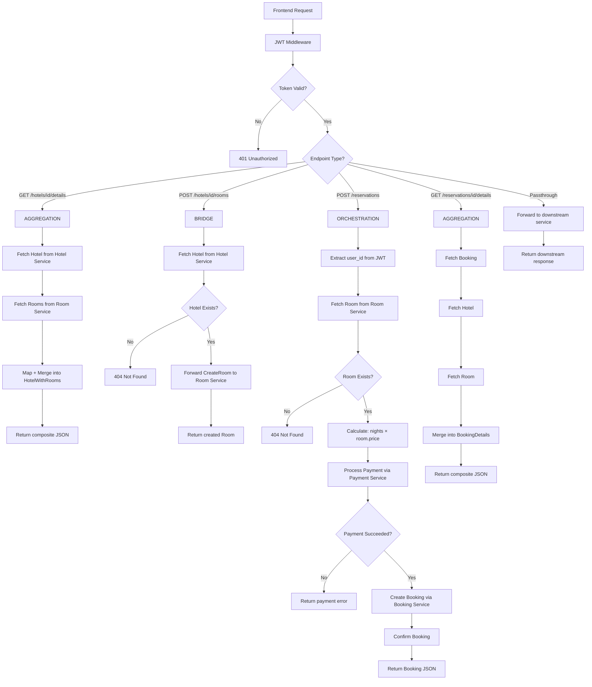
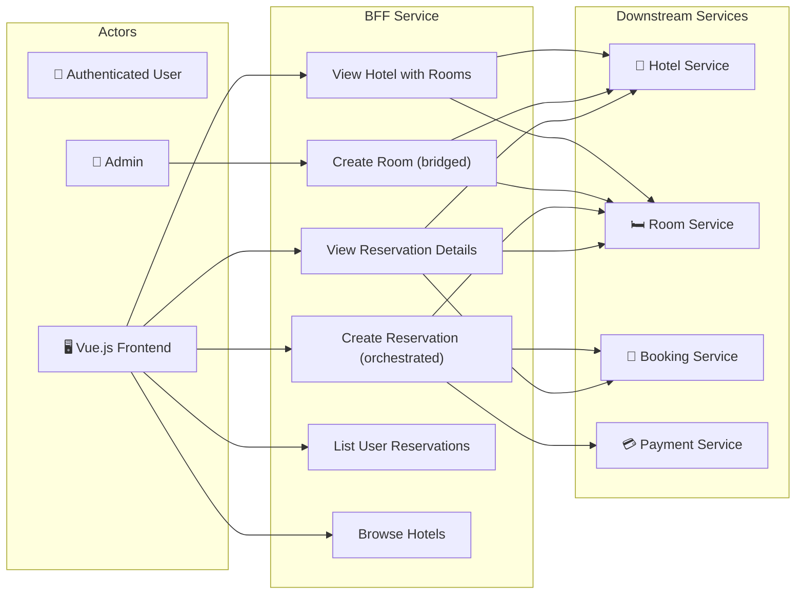
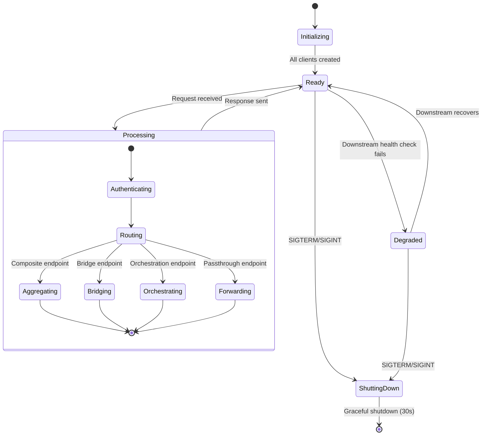
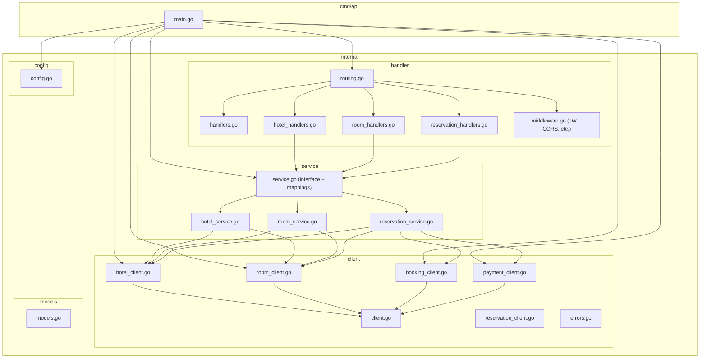

# 🔄 Backend for Frontend (BFF)

> Orchestration layer that aggregates and enriches data from multiple microservices for the frontend.

## Overview

The Backend-for-Frontend (BFF) is the **orchestration layer** between the frontend (Vue.js SPA) and the downstream microservices. It serves three key purposes:

1. **Data Aggregation** — Merges data from Hotel, Room, and Booking services into composite responses (e.g., hotel details + room list, reservation + hotel + room info)
2. **Service Bridging** — Validates cross-service constraints before forwarding (e.g., verifies hotel exists before creating a room in it)
3. **Business Enrichment** — Calculates derived fields like `total_price = room.price × nights` and injects `user_id` from JWT claims

## Tech Stack

| Layer | Technology |
|---|---|
| Language | Go 1.25 |
| Router | [go-chi/chi](https://github.com/go-chi/chi) v5 |
| Auth | JWT verification (RSA-256 public key) |
| HTTP Clients | Custom typed clients for each downstream service |
| Container | Docker (multi-stage Alpine build) |

## Architecture

```
app/
├── cmd/api/          # Application entrypoint
│   └── main.go
├── internal/
│   ├── client/       # HTTP clients for downstream services
│   │   ├── client.go           # Base HTTP client
│   │   ├── errors.go           # Client error types
│   │   ├── hotel_client.go     # Hotel Service client
│   │   ├── room_client.go      # Room Service client
│   │   ├── reservation_client.go  # Legacy reservation client
│   │   ├── booking_client.go   # Booking Service client
│   │   └── payment_client.go   # Payment Service client
│   ├── config/       # YAML config loader with env var expansion
│   ├── handler/      # HTTP handlers, routing, JWT middleware
│   │   ├── handlers.go            # Base handler + health checks
│   │   ├── hotel_handlers.go      # Hotel aggregation endpoints
│   │   ├── room_handlers.go       # Room bridge endpoints
│   │   ├── reservation_handlers.go # Reservation orchestration
│   │   ├── middleware.go          # JWT, CORS, security, rate limit
│   │   └── routing.go            # Route definitions
│   ├── helper/       # Response helpers
│   ├── logging/      # Structured slog logger
│   ├── models/       # Aggregated domain models
│   │   └── models.go             # Hotel, Room, Booking, composite types
│   └── service/      # Business logic layer
│       ├── service.go            # Service interface + mappings
│       ├── hotel_service.go      # Hotel operations
│       ├── room_service.go       # Room operations
│       └── reservation_service.go # Reservation orchestration
├── config.yaml
├── Dockerfile
└── go.mod
```

## API Endpoints

All endpoints require JWT authentication (except health checks).

### Public Routes

| Method | Path | Description |
|---|---|---|
| `GET` | `/health` | Liveness probe |
| `GET` | `/ready` | Readiness probe (checks downstream services) |

### Hotel Aggregation Endpoints

| Method | Path | Type | Description |
|---|---|---|---|
| `GET` | `/hotels` | Passthrough | List hotels (forwarded to Hotel Service) |
| `GET` | `/hotels/{hotelId}` | Passthrough | Get hotel details |
| `GET` | `/hotels/{hotelId}/details` | **Aggregation** | Hotel + all its rooms (merged) |

### Room Bridge Endpoints

| Method | Path | Type | Description |
|---|---|---|---|
| `GET` | `/rooms/{roomId}` | Passthrough | Get room details |
| `POST` | `/hotels/{hotelId}/rooms` | **Bridge** | Verify hotel exists → create room |

### Reservation Orchestration Endpoints

| Method | Path | Type | Description |
|---|---|---|---|
| `GET` | `/reservations` | Passthrough | List user's reservations |
| `GET` | `/reservations/{id}` | Passthrough | Get reservation |
| `GET` | `/reservations/{id}/details` | **Aggregation** | Reservation + hotel + room (merged) |
| `POST` | `/reservations` | **Orchestration** | Full booking flow (validate → price → pay → book) |

## Flow Diagram



## Use Case Diagram



## State Diagram



## Package Diagram



## Reservation Orchestration (Detailed)

The `POST /reservations` endpoint is the most complex flow:

```
1. Extract user_id from JWT claims
2. Validate CreateBookingRequest
3. Fetch Room from Room Service → get price_per_night
4. Parse start_date, end_date
5. Calculate: nights = (end_date - start_date).days
6. Calculate: total_price = nights × price_per_night
7. Process payment via Payment Service
   - Send: booking_id (pre-generated), amount, payment_method_id
   - On failure → return error (no booking created)
8. Create Booking via Booking Service
   - Send: user_id, hotel_id, room_id, dates, total_price, guest info
9. Confirm Booking via Booking Service
   - PATCH status → "confirmed"
10. Return confirmed Booking to frontend
```

## Configuration

```yaml
server:
  port: 8080

downstream_services:
  hotel_service_url: "${HOTEL_SERVICE_URL}"
  room_service_url: "${ROOM_SERVICE_URL}"
  booking_service_url: "${BOOKING_SERVICE_URL}"
  reservation_service_url: "${RESERVATION_SERVICE_URL}"
  payment_service_url: "${PAYMENT_SERVICE_URL}"
  timeout: 30s

rate_limit:
  enabled: true
  requests_per_second: 100
  burst: 200
```

### Environment Variables

| Variable | Description |
|---|---|
| `HOTEL_SERVICE_URL` | Hotel Service URL (e.g., `http://hotel-service:8080`) |
| `ROOM_SERVICE_URL` | Room Service URL |
| `BOOKING_SERVICE_URL` | Booking Service URL |
| `RESERVATION_SERVICE_URL` | Reservation Service URL (same as booking) |
| `PAYMENT_SERVICE_URL` | Payment Service URL |

### Volume Mounts (Docker)

| Host Path | Container Path | Description |
|---|---|---|
| `./keys/public.pem` | `/app/keys/public.pem` | JWT verification key |

## Port Mapping

| Context | Port |
|---|---|
| Internal (container) | `8080` |
| External (host) | `8087` |
